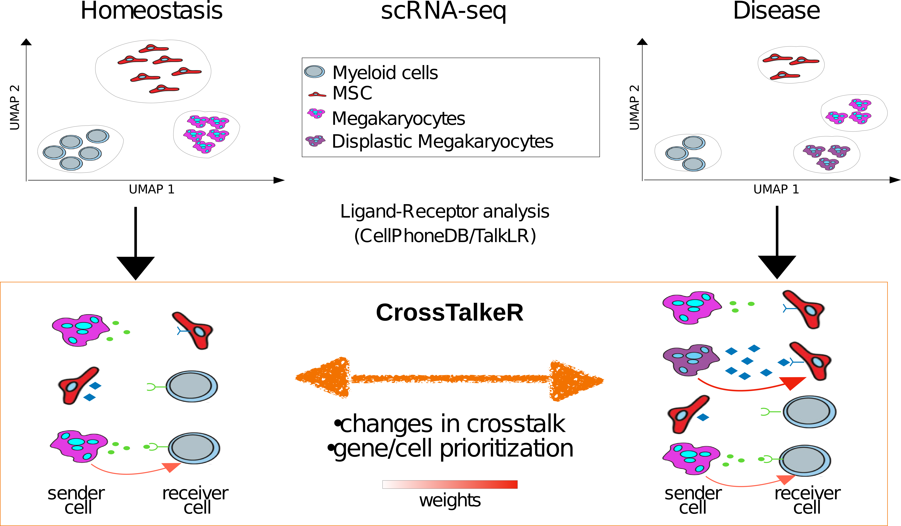

# CrossTalker

[](https://zenodo.org/badge/latestdoi/329572127)
[](https://GitHub.com/CostaLab/CrossTalkeR.js/graphs/commit-activity)
[](https://github.com/CostaLab/CrossTalkeR.js/blob/master/LICENSE)
[](https://GitHub.com/CostaLab/CrossTalkeR/releases/)


James S. Nagai<sup>1</sup>,
Nils B. Leimkühler<sup>2</sup>,
Rebekka K. Schneider<sup>2,3,4</sup>,
Ivan G. Costa<sup>1*</sup>

<sup>1</sup>Institute for Computational Genomics, Faculty of Medicine, RWTH Aachen University, Aachen, 52074 Germany

<sup>2</sup>Department of Hematology, Erasmus Medical Center, Rotterdam, 3015GD, the Netherlands

<sup>3</sup>Department of Cell Biology, Institute for Biomedical Engineering, Faculty of Medicine,RWTH Aachen University, Pauwelsstrasse 30, 52074 Aachen, NRW, Germany

<sup>4</sup>Oncode Institute, Erasmus Medical Center, Rotterdam, 3015GD, the Netherlands




```{r}
install.packages("devtools")
devtools::install_github("https://github.com/CostaLab/CrossTalkeR")
require(CrossTalkeR)
```

CrossTalkNet aims to provide a user friendly way to visualize cellular crosstalk through ligand receptor networks. It use as input the Ligand Receptor Inference Tool Results to build a sharable report with main network based analysis


## Current Features v0.9.7
- Single and Comparative Reports
   - Cell Cell Interaction visualization
   - Sending and Receiving Cells Ranking
   - Gene Target based Sankey Plots
   - CCI and GCI PCA ranking
      - All measures and PC table
      - PC1 and PC2 based barplot
   - Leimkühler et. al. [1] data were added to the package


# References

[1]Heterogeneous bone-marrow stromal progenitors drive myelofibrosis via a druggable alarmin axis. [link](https://www.cell.com/cell-stem-cell/fulltext/S1934-5909(20)30542-7#secsectitle0115)

[2] CrossTalkNet: Analysis and Visualisation of LigandReceptor Networks. (ongoing work)
