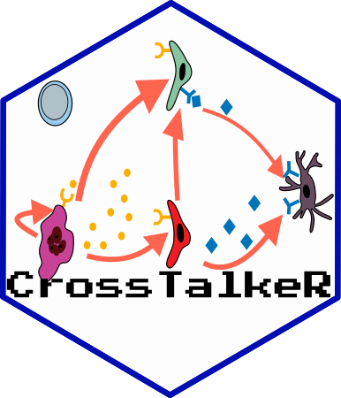

# CrossTalkeR 

[](https://doi.org/10.5281/zenodo.4740646)
[](https://GitHub.com/CostaLab/CrossTalkeR.js/graphs/commit-activity)
[](https://github.com/CostaLab/CrossTalkeR.js/blob/master/LICENSE)
[](https://GitHub.com/CostaLab/CrossTalkeR.js/releases/)


James S. Nagai<sup>1</sup>,
Nils B. Leimkühler<sup>2</sup>,
Michael T. Schaub <sup>3</sup>,
Rebekka K. Schneider<sup>4,5,6</sup>,
Ivan G. Costa<sup>1*</sup>

<sup>1</sup>Institute for Computational Genomics, Faculty of Medicine, RWTH Aachen University, Aachen, 52074 Germany

<sup>2</sup>Department of Hematology and Stem Cell Transplantation, University Hospital Essen, Germany

<sup>3</sup>Department of Computer Science, RWTH Aachen University, Germany

<sup>4</sup>Department of Cell Biology, Institute for Biomedical Engineering, Faculty of Medicine,RWTH Aachen University, Pauwelsstrasse 30, 52074 Aachen, NRW, Germany

<sup>5</sup>Oncode Institute, Erasmus Medical Center, Rotterdam, 3015GD, the Netherlands

<sup>6</sup>Department of Hematology, Erasmus Medical Center, Rotterdam, 3015GD, the Netherlands


**Motivation:** Ligand-receptor (LR) analysis allows the characterization of cellular crosstalk from single cell RNA-seq data. However, current LR methods provide limited approaches for prioritization of cell types, ligands or receptors or characterizing changes in crosstalk between two biological conditions.

**Results:** CrossTalkeR is a framework for network analysis and visualisation of LR networks. CrossTalkeR identifies relevant ligands, receptors and cell types contributing to changes in cell communication when contrasting two biological states: disease vs. homeostasis. A case study on scRNA-seq of human myeloproliferative neoplasms reinforces the strengths of CrossTalkeR for characterisation of changes in cellular crosstalk in disease state.

## Install

You can install CrossTalkeR with the simple commands below:


```
install.packages("devtools")
devtools::install_github("https://github.com/CostaLab/CrossTalkeR", build_vignettes = TRUE)
require(CrossTalkeR)
```

*Note: Please avoid to use the following characters in celltype name: '$'*

## Possible system dependencies

```
libudunits2-dev
libgdal-dev
gdal-bin
libproj-dev
proj-data
proj-bin
libgeos-dev
```

## CrossTalkeR Plots examples and vignette

We provide in our vignette examples on how to analyse cell interactions from a human myelofibrosis single cell RNA-seq.

```
vignette('CrossTalkeR-HumanMyfib')
```


## Integration of liana with CrossTalkeR

We provide here a tutorial on how to integrate predictions from liana into Crosstalker.

[Run liana](https://github.com/CostaLab/CrossTalkeR/blob/master/vignettes/run_liana.rmd)

## New Features v1.4.0

- Splitted generate_report function in two parts:
  - analise_LR() to only run the analysis without generating the CrossTalkeR report
  - make_report() to only generate a new CrossTalkeR report for existing CrossTalkeR results
- Added node types to the network:
  - we now consider the annotation of a gene as ligand (L) or receptor (R) to consider the biological function 
- Less constrains on the cell cluster name annotation (only '$' must be avoided in the cluster naming)
- Integration with liana-py for ligand-receptor interaction predictions
  

## Old Features v1.3.0

- Single and Comparative Reports
   - Cell Cell Interaction visualization
   - Sending and Receiving Cells Ranking
   - Gene Target based Sankey Plots
   - CCI and GCI PCA ranking
      - All measures and PC table
      - PC1 and PC2 based barplot
   - Leimkühler et. al. [2] data were added to the package
   - Fisher Test were implemented to highlight the CCI edges significance (new) 🔥**NEW**🔥
   - **Change input format: Please see the Documentation** 🔥**NEW**🔥
      - A python3 notebook are available to cast the old input to the new input.
   - Liana (Dimitrov et. al. [3]) Output can be used as CrossTalkeR input. 🔥**NEW**🔥
   - LR pair visualization plot can be done using a Seurat Object 🔥**NEW**🔥

# References

[1] CrossTalkeR: Analysis and Visualisation of Ligand Receptor Networks [link](https://doi.org/10.1093/bioinformatics/btab370)

[2] Heterogeneous bone-marrow stromal progenitors drive myelofibrosis via a druggable alarmin axis. [link](https://www.cell.com/cell-stem-cell/fulltext/S1934-5909(20)30542-7#secsectitle0115)

[3] Comparison of Resources and Methods to infer Cell-Cell Communication from Single-cell RNA Data [link](https://www.biorxiv.org/content/10.1101/2021.05.21.445160v1.full)
