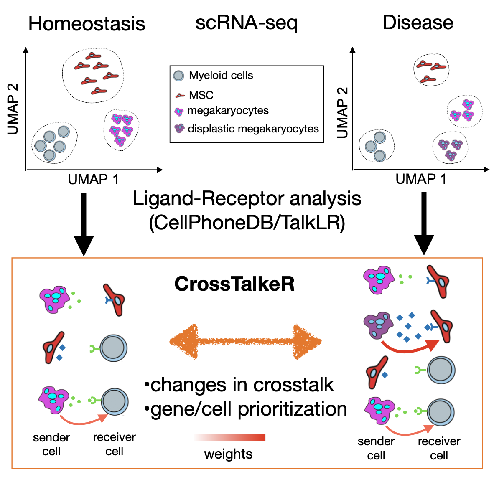

# CrossTalker

[](https://zenodo.org/badge/latestdoi/329572127)
[](https://GitHub.com/CostaLab/CrossTalkeR.js/graphs/commit-activity)
[](https://github.com/CostaLab/CrossTalkeR.js/blob/master/LICENSE)
[](https://GitHub.com/CostaLab/CrossTalkeR.js/releases/)


James S. Nagai<sup>1</sup>,
Nils B. Leimkühler<sup>2</sup>,
Rebekka K. Schneider<sup>2,3,4</sup>,
Ivan G. Costa<sup>1*</sup>

<sup>1</sup>Institute for Computational Genomics, Faculty of Medicine, RWTH Aachen University, Aachen, 52074 Germany

<sup>2</sup>Department of Hematology, Erasmus Medical Center, Rotterdam, 3015GD, the Netherlands

<sup>3</sup>Department of Cell Biology, Institute for Biomedical Engineering, Faculty of Medicine,RWTH Aachen University, Pauwelsstrasse 30, 52074 Aachen, NRW, Germany

<sup>4</sup>Oncode Institute, Erasmus Medical Center, Rotterdam, 3015GD, the Netherlands




**Motivation:** Ligand-receptor (LR) analysis allows the characterization of cellular crosstalk from single cell RNA-seq data. However, current LR methods provide limited approaches for prioritization of cell types, ligands or receptors or characterizing changes in crosstalk between two biological conditions. 

**Results:** CrossTalkeR is a framework for network analysis and visualisation of LR networks. CrossTalkeR identifies relevant ligands, receptors and cell types contributing to changes in cell communication when contrasting two biological states: disease vs. homeostasis. A case study on scRNA-seq of human myeloproliferative neoplasms reinforces the strengths of CrossTalkeR for characterisation of changes in cellular crosstalk in disease state.

## Install 

You can install CrossTalkeR with the simple comands below:


```{r}
install.packages("devtools")
devtools::install_github("https://github.com/CostaLab/CrossTalkeR")
require(CrossTalkeR)
```

*Note: Please avoid to use the following characters in celltype name: '_' and '\\' *

## Possible system dependencies

```
libudunits2-dev 
libgdal-dev 
gdal-bin 
libproj-dev 
proj-data 
proj-bin 
libgeos-dev 

```

## CrossTalkeR Plots examples and vignette

We provide in our vignette examples on how to analyse cell interactions from a human myelofibrosis single cell RNA-seq. 

```{r}
vignette('CrossTalkeR')
```


## Integration of CellPhoneDB with CrossTalkeR

We provide here a tutorial on how to integrate preditions from CellPhoneDB into Crosstalker. 

[CellPhoneDB Tutorial.md](https://github.com/CostaLab/CrossTalkeR/blob/master/CellPhoneDB%20Tutorial.md)


## Current Features v1.0.0
- Single and Comparative Reports
   - Cell Cell Interaction visualization
   - Sending and Receiving Cells Ranking
   - Gene Target based Sankey Plots
   - CCI and GCI PCA ranking
      - All measures and PC table
      - PC1 and PC2 based barplot
   - Leimkühler et. al. [2] data were added to the package


# References

[1] CrossTalkNet: Analysis and Visualisation of LigandReceptor Networks. (in preparation)

[2]Heterogeneous bone-marrow stromal progenitors drive myelofibrosis via a druggable alarmin axis. [link](https://www.cell.com/cell-stem-cell/fulltext/S1934-5909(20)30542-7#secsectitle0115)


