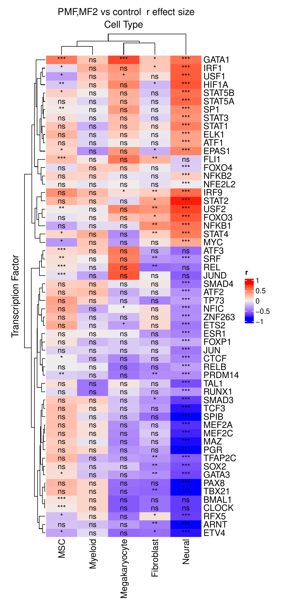
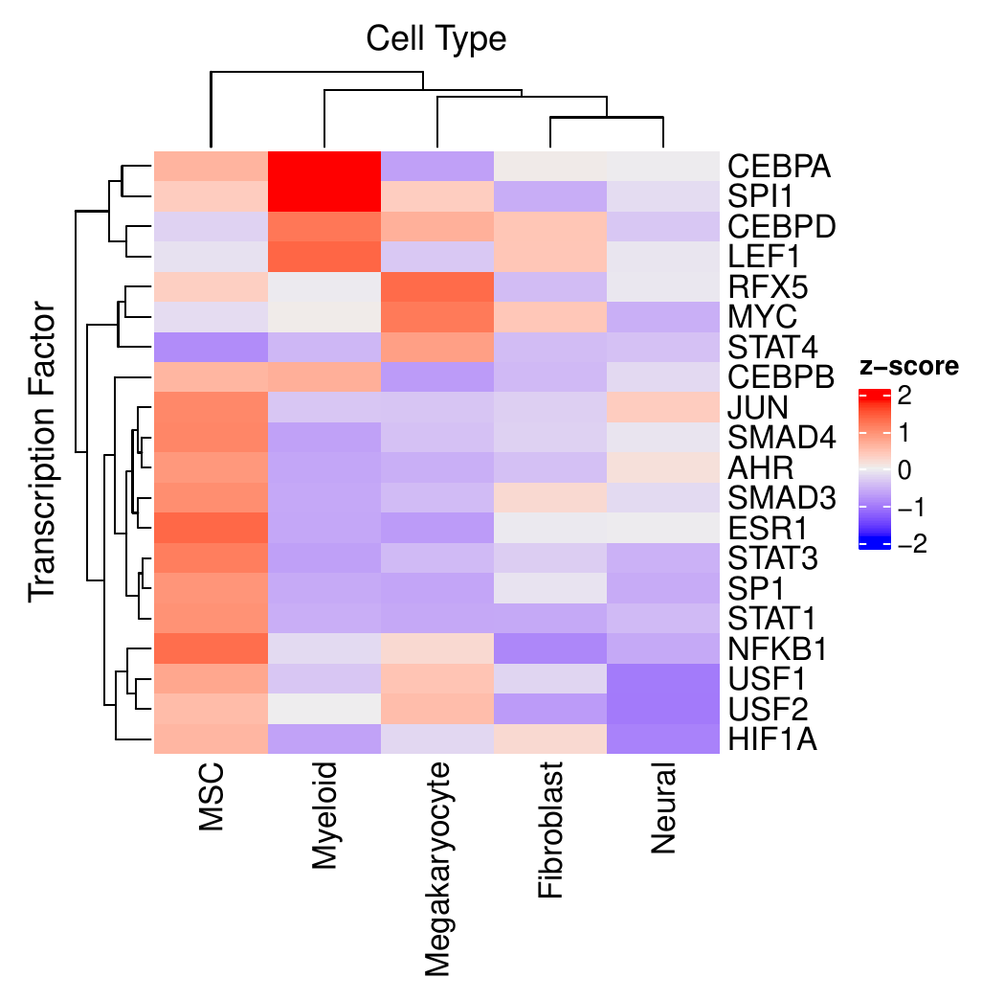
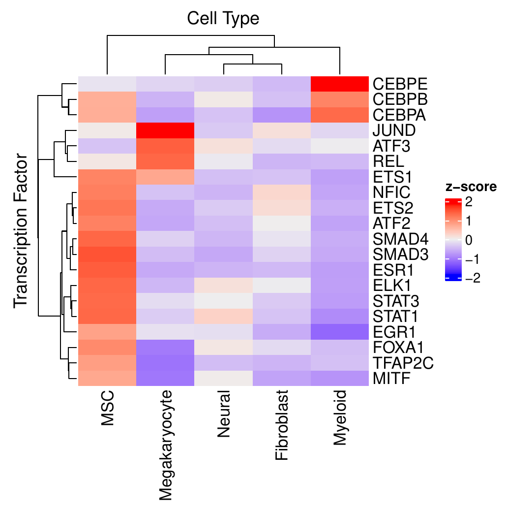
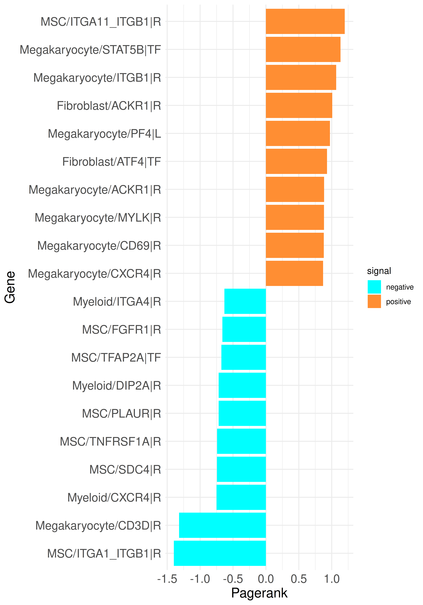
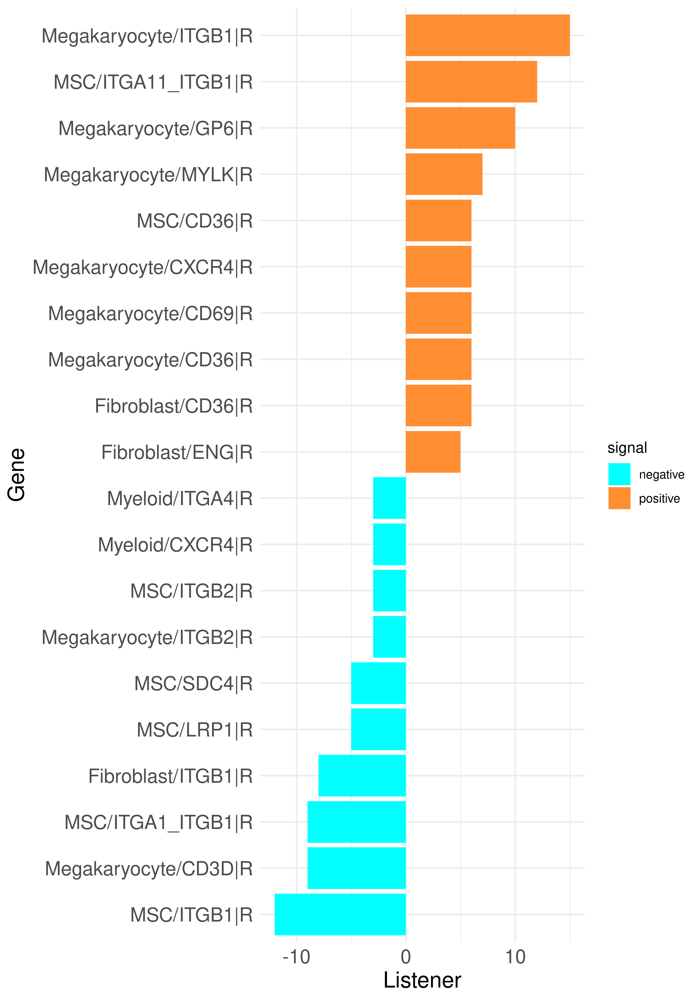
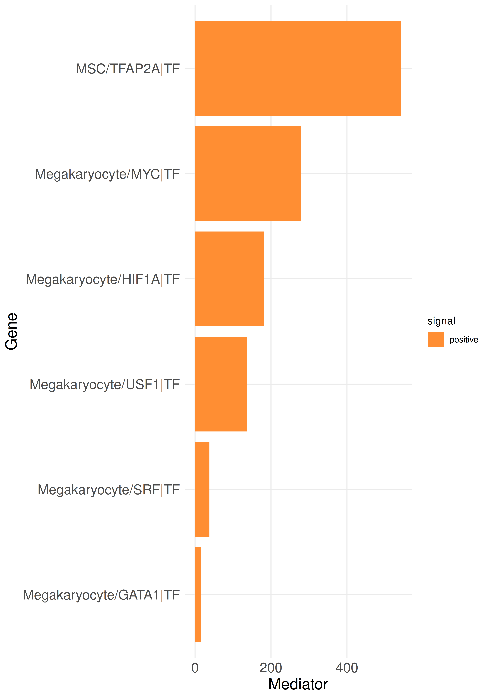
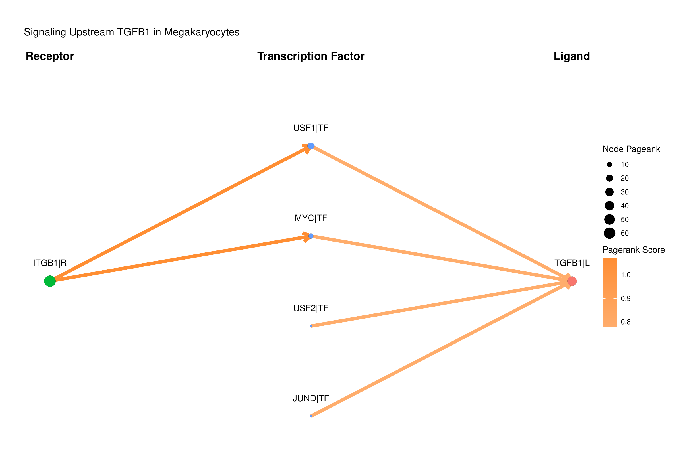
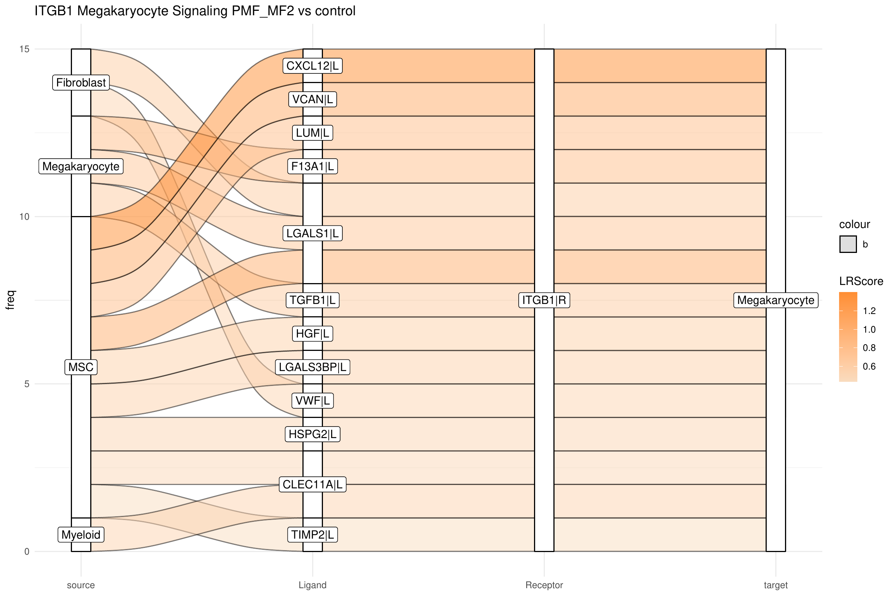

# Intracellular Communication Analysis on Human Myelofibrosis scRNA-seq Data Using the LR2TF Package and CrossTalkeR

This is a guide for the usage of the LR2TF package to infer TF activities from scRNA-seq data. The transcription factor activities are estimated using the decoupleR tool. Using the DoRothEA regulon version from decoupleR and post-translational interactions from the Omnipath database[2,3,4], connections are made between transcription factors and ligands and receptors.

The results can be combined with ligand-receptor interactions and then analyzed using CrossTalkeR (https://github.com/CostaLab/CrossTalkeR/) [5].

## Installation
The package can be installed directly from github:
&nbsp;

```{r, include = TRUE, eval = FALSE}
library(devtools)
install_github("CostaLab/LR2TF")

library(remotes)
install_github("CostaLab/LR2TF", build_vignettes = TRUE)
```
&nbsp;

## Transcription Factor Activity Predictions Using decoupleR in Python

For the transcription factor activity predictions we recommend using the decoupleR package in its python version. This provides a better performance, especially for larger data sets. To perform the predictions with decoupleR, we need an AnnData (.h5ad) file. If the scRNA-seq data is saved as a Seurat object (.Rds file), it can be converted to AnnData format using the sceasy package and the function we provide:

```{r, include = TRUE, eval = FALSE}
library(LR2TF)
library(Seurat)

# load own dataset:
seurat_object <- readRDS("/path/to/seurat_object.Rds")

# test dataset from package:
data(bone_marrow_stromal_cell_example, package = "LR2TF")
seurat_object <- bone_marrow_stromal_cell_example

LR2TF::convert_seurat_to_anndata(seurat_object, "/path/to/save/AnnData/object/")
```

The file "anndata_object.h5ad" will be saved into the user defined path and then used to perform the predictions. Beside the scRNA-seq data file, we also need to define a regulon database in form of a csv file with the coloumns "source", "target" and "weight". Within this package we provide the dorothea databases for human and mouse, downloaded from the decoupleR package. These files also contain the column "confidence" (levels A to D) with information on how well described a transcription factor and target gene interaction is in different resources. We recommend using the confidence levels A and B.

```{r, include = TRUE, eval = FALSE}
regulon <- read.csv(system.file("regulons", "human_dorothea_reg.csv", package = "LR2TF"), row.names = 1)
filtered_regulon <- regulon[regulon$confidence %in% c("A", "B"), ]
write.csv("/path/to/save/filterd_regulon.csv")
```

Now it is possible to run the transcription factor activity prediction with decoupleR. Here we are using the Univariate Linear Model (ulm) approach recommended by the authors:
```{python, include = TRUE, eval = FALSE}

import scanpy as sc
import decoupler as dc
import pandas as pd

ann_data = sc.read_h5ad("/path/to/AnnData/object/anndata_object.h5ad")
reg = pd.read_csv("/path/to/filterd_regulon.csv")

dc.run_ulm(mat=ann_data, net=reg, source='source', target='target', weight='weight', verbose=True, use_raw=False)

estimates = ann_data.obsm['ulm_estimate']
estimates.to_csv("/path/to/save/decoupler_results.csv")

```

## Using the LR2TF package
Now, that we have a transcription factor activity matrix, we can continue the analysis with the LR2TF package. In this case we will use our test data for this example. First of all, it is necessary to define the following parameters in form of a list:

```{r eval = FALSE}
parameters <- list(
  "out_path" = "/path/to/save/results",
  reg = "/path/to/filterd_regulon.csv",
  "organism" = "human",
  "celltype" = "new_annotation", # name of the meta data field defining cell identities
  "condition" = "protocol", # name of the meta data field defining conditions
  "comparison_list" = list(c("PMF,MF2", "control")), # list of condition comparison to consider
  "logfc" = 0.5,
  "pval" = 0.05, # thresholds for logfc and pval used in differential transcription factor analysis
  "num_cell_filter" = 0
) # define the minimum number of cells per cluster to perform the analysis on
```

After defining the necessary parameter the transcription factor activity can be performed by calling:

```{r, include = TRUE, eval = FALSE}
results <- LR2TF::tf_activity_analysis(
  seuratobject = seurat_object,
  tf_activities = "/path/to/decoupler_results.csv",
  arguments_list = parameters
)
```

The "results" object contains the results of the performed analyses, consisting of multiple tables inside the object:

1. **tf_activities_condition:**
        Tables with condition significant transcription factors for each compared condition
2. **tf_activities_cluster:**
         Tables with cluster specific transcription factors for all conditions in the data
3. **average_gene_expression:**
         Matrices for each condition with average gene expressions
4. **regulon:**
         Regulon used for the analysis as specified by the user
5. **CTR_input_condition:**
         for each condition a table with receptor-transcription factor and transcription factor-ligand interactions based on condition specific transcription factors (input for CrossTalker)
6. **CTR_input_cluster:**
         for each condition a table with receptor-transcription factor and transcription factor-ligand interactions based on cluster specific transcription factors (input for CrossTalker)
7. **intracellular_network_condition:**
         for each condition a table with receptor-transcription factor and transcription factor-target gene interactions based on condition specific transcription factors
8. **intracellular_network_cluster:**
         for each condition a table with receptor-transcription factor and transcription factor-target gene interactions based on cluster specific transcription factors

(Note that special characters might be exchanged by underscores, if they cause problems with the naming of the tables; eg PMF,MF2 -> PMF_MF2)

### Transcription Factor Activity Analysis Plots

As already outlined in the result object description, two different analysis approaches are used to identify which predicted TF activities are significant. The first approach focuses on the comparison between different sample conditions (here, control vs. fibrosis). During the analysis, a large heatmap is generated that includes all TFs showing significant differential activity between the conditions in at least one of the cell clusters.


<figcaption>Heatmap showing TFs that show significant differences in their activities between the PMF_MF2 and control condition. The significance level is given by the asterisk symbol: * p-value < 0.05, ** p-value < 0.01, *** p-value < 0.001.</figcaption>

&nbsp;

The second approach focuses on identifying cluster-specific TFs within the different conditions separately. In addition to a similar heatmap as in the condition comparison, heatmaps are provided to show the most variable TFs among all cell clusters.

<div style = "display: flex; align-items: center; justify-content: center;">
<figure class="figure" style="display: table; margin: auto; height: 60%; width: 60%;">
  
  <figcaption class="figcaption" style="display: table-caption; caption-side: bottom;">Heatmap showing TFs with highly variable activity between the clusters in the control condition.</figcaption>
</figure>
<figure class="figure" style="display: table; margin: auto; height: 60%; width: 60%;">
  
  <figcaption class="figcaption" style="display: table-caption; caption-side: bottom;">Heatmap showing TFs with highly variable activity between the clusters in the PMF_MF2 condition.</figcaption>
</figure>
</div>

&nbsp;

## Running CrossTalkeR with TF Predictions
The last step is to combine previous results from ligand receptor interaction analyses (e.g. CellPhoneDB) with the transcription factor results. (In the case of the test data the ligand-receptor interactions are provided within the CrossTalkeR package. Note that these results include receptor complexes.)
```{r, include = TRUE, eval = FALSE}
# First possibility: Read the csv files with LR interaction results and then combine them with the TF interaction results
table_ctr <- read.csv("/path/to/control_lr_results.csv", row.names = 1)
table_exp <- read.csv("/path/to/PMF,MF2_lr_results.csv", row.names = 1)

ctr_inptu <- LR2TF::combine_LR_and_TF_complexes(results@CTR_input_condition[["control"]], table_ctr, parameters$out_path, "control")
exp_input <- LR2TF::combine_LR_and_TF_complexes(results@CTR_input_condition[["PMF_MF2"]], table_exp, parameters$out_path, "PMF_MF2")

# Second possibility: Directly pass the path to the LR interaction csv files to combine them with the TF interaction results
ctr_file <- "/path/to/control_lr_results.csv"
exp_file <- "/path/to/PMF,MF2_lr_results.csv"

ctr_inptu <- LR2TF::combine_LR_and_TF_complexes(results@CTR_input_condition[["control"]], ctr_file, parameters$out_path, "control")
exp_input <- LR2TF::combine_LR_and_TF_complexes(results@CTR_input_condition[["PMF_MF2"]], exp_file, parameters$out_path, "PMF_MF2")
```

Now that there is one input table for each condition of interest, these can be used to run CrossTalkeR:

```{r, warning=FALSE,message=F, output=FALSE, eval = FALSE}
library(CrossTalkeR)
library(igraph)
library(stringr)

paths <- c(
  "control" = ctr_inptu,
  "PMF_MF2" = exp_input
)

output <- ("/path/to/save/folder")
data <- generate_report(paths,
  out_path = paste0(output, "/"),
  out_file = "HumanMyfib_TF_example.html",
  output_fmt = "html_document",
  report = TRUE,
  comparison = list(c("PMF_MF2", "control"))
)
```

## CrossTalkeR Results

Incorporating TFs into the CrossTalkeR analysis introduces greater complexity to the network, particularly at the CGI level. Since the CCI component emphasizes intercellular communication, TFs — which contribute to potential intracellular interactions — are excluded from this aspect of the analysis, leaving the results unchanged. Therefore, this segment of the example concentrates on the modifications observed in the CGI component. Furthermore, we utilize only the results from the comparison report because condition-specific TFs were used in the CrossTalkeR analysis.

A first example is to compare the PageRank results of a run with only LR genes to the current with added TFs. A barplot with the top up and down PageRank scored genes can be generated like this:

```{r, warning=FALSE,message=F, output=FALSE, eval = FALSE}
library(CrossTalkeR)
library(igraph)
library(stringr)

plot_bar_rankings_cgi(data, "PMF_MF2_x_control_ggi", ranking = "Pagerank")
```

Now we can compare the results from CrossTalkeR with only LR (left) and the results with TFs (right):

<div style = "display: flex; align-items: center; justify-content: center;">
<figure class="figure" style="display: table; margin: auto; height: 60%; width: 60%;">
  
  <figcaption class="figcaption" style="display: table-caption; caption-side: bottom;"> </figcaption>
</figure>
<figure class="figure" style="display: table; margin: auto; height: 60%; width: 60%;">
  
  <figcaption class="figcaption" style="display: table-caption; caption-side: bottom;"> </figcaption>
</figure>
</div>

&nbsp;  

It can be observed that the inclusion of TFs increases the variability of gene types coming up in the top genes. The ITGB1 receptor in megakaryocytes remains among the top genes and several TFs are also present in the results; for example, STAT5B in megakaryocytes and ATF4 in Fibroblasts are among the upregulated genes, while TFAP2A in MSCs is among the down regulated genes. We can analyze not only the PageRank but also examine the top genes from other rankings. For this purpose, the previously used method call can be adjusted:

```{r, warning=FALSE,message=F, output=FALSE, eval = FALSE}
library(CrossTalkeR)
library(igraph)
library(stringr)

plot_bar_rankings_cgi(data, "PMF_MF2_x_control_ggi", ranking = "Influencer", type = "L")

plot_bar_rankings_cgi(data, "PMF_MF2_x_control_ggi", ranking = "Listener", type = "R")

plot_bar_rankings_cgi(data, "PMF_MF2_x_control_ggi", ranking = "Mediator", type = "TF")
```

&nbsp;   

<div style = "display: flex; align-items: center; justify-content: center;">
<figure class="figure" style="display: table; margin: auto; height: 60%; width: 60%;">
  
  <figcaption class="figcaption" style="display: table-caption; caption-side: bottom;"> </figcaption>
</figure>
<figure class="figure" style="display: table; margin: auto; height: 60%; width: 60%;">
  
  <figcaption class="figcaption" style="display: table-caption; caption-side: bottom;"> </figcaption>
</figure>
</div>
<figure class="figure" style="display: table; margin: auto; height: 50%; width: 50%;">
  
  <figcaption class="figcaption" style="display: table-caption; caption-side: bottom;"> </figcaption>
</figure>

&nbsp;

By integrating intracellular signaling into our analysis, we can now trace predicted signaling pathways within cells to determine whether incoming signals induce responses in specific cell types or, conversely, to identify the upstream regulators of an active ligand. As example, we can select the top influencer ligand, TGFB1 in megakaryocytes, from the top listener barplot. We begin by generating a standard LR Sankey plot to visualize the intercellular interactions involving TGFB1:

```{r, warning=FALSE,message=F, output=FALSE, eval = FALSE}
library(CrossTalkeR)
library(igraph)
library(stringr)

plot_sankey(data@tables$PMF_MF2_x_control,
    target = "TGFB1|L",
    ligand_cluster = "Megakaryocyte",
    receptor_cluster = NULL,
    plt_name = "TGFB1 Megakaryocyte Signaling PMF_MF2 vs control",
    threshold = 50, tfflag = FALSE
)
```

<figure class="figure" style="display: table; margin: auto; height: 90%; width: 90%;">
  
  <figcaption class="figcaption" style="display: table-caption; caption-side: bottom;"> </figcaption>
</figure>

&nbsp;

Now, we are introducing a new graph sankey plot, that shows the upstream signaling of TGFB1 in megakaryocytes:

```{r, warning=FALSE,message=F, output=FALSE, eval = FALSE}
library(CrossTalkeR)
library(igraph)
library(stringr)

pagerank_table = data@rankings$PMF_MF2_x_control_ggi %>%
  select(c("nodes", "Pagerank"))
pagerank_table = as.data.frame(pagerank_table)
rownames(pagerank_table) = pagerank_table$nodes

plot_graph_sankey_tf(data@tables$PMF_MF2_x_control,
    pagerank_table,
    target = "TGFB1|L",
    cluster = "Megakaryocyte",
    target_type = "Ligand",
    plt_name = "Signaling Upstream TGFB1 in Megakaryocytes")

```

&nbsp;  

<figure class="figure" style="display: table; margin: auto; height: 90%; width: 90%;">
  
  <figcaption class="figcaption" style="display: table-caption; caption-side: bottom;"> </figcaption>
</figure>

&nbsp;

In this plot, we focus on the PageRank of the included genes. Each node's weight represents the corresponding PageRank value of each gene, and the edges are weighted by the PageRank values of the receptors or ligands involved in the interactions. In the example, multiple TFs predicted to regulate the TGFB1 gene are shown to be active. Notably, one of these TFs, MYC, is identified as the top mediator TF. While MYC was previously described to have a profibrotic role [6], its role in megakaryocytes has not yet been further studied, suggesting potential opportunities for investigation. 

To follow up on connecting TGFB1 further to upstream signals, we focus now on the top listener receptor, ITGB1, which is here predicted to be upstream of MYC in megakaryocytes. Building on this, we examine the top incoming signals and the cell types from which they originate, targeting ITGB1 in megakaryocytes:

```{r, warning=FALSE,message=F, output=FALSE, eval = FALSE}
library(CrossTalkeR)
library(igraph)
library(stringr)

plot_sankey(data@tables$PMF_MF2_x_control,
    target = "ITGB1|R",
    ligand_cluster = NULL,
    receptor_cluster = "Megakaryocyte",
    plt_name = "ITGB1 Megakaryocyte Signaling PMF_MF2 vs control",
    threshold = 50, tfflag = FALSE
)

```

<figure class="figure" style="display: table; margin: auto; height: 90%; width: 90%;">
  
  <figcaption class="figcaption" style="display: table-caption; caption-side: bottom;"> </figcaption>
</figure>

&nbsp;

If we put together the sepparated signalig plots, we can receive this signaling chain through the megakaryocyte cells (this image is not automatically generated):

<figure class="figure" style="display: table; margin: auto; height: 110%; width: 110%;">
  
  <figcaption class="figcaption" style="display: table-caption; caption-side: bottom;"> </figcaption>
</figure>

&nbsp;


## References

[1] Garcia-Alonso L, Holland CH, Ibrahim MM, Turei D, Saez-Rodriguez J. “Benchmark and integration of resources for the estimation of human transcription factor activities.” Genome Research. 2019. DOI: 10.1101/gr.240663.118.

[2] A Valdeolivas, D Turei, A Gabor (2019) “OmnipathR: client for the OmniPath web service.” Bioconductor Package

[3] D Turei, T Korcsmaros and J Saez-Rodriguez (2016) OmniPath: guidelines and gateway for literature-curated signaling pathway resources. Nature Methods 13 (12); PMID: 27898060

[4] D Turei, A Valdeolivas, L Gul, N Palacio-Escat, M Klein, O Ivanova, M Olbei, A Gabor, F Theis, D Modos, T Korcsmaros and J Saez-Rodriguez (2021) Integrated intra- and intercellular signaling knowledge for multicellular omics analysis. Molecular Systems Biology 17: e9923; DOI: 10.15252/msb.20209923

[5] James S Nagai, Nils B Leimkühler, Michael T Schaub, Rebekka K Schneider, Ivan G Costa, CrossTalkeR: analysis and visualization of ligand–receptorne tworks, Bioinformatics, Volume 37, Issue 22, 15 November 2021, Pages 4263–4265, https://doi.org/10.1093/bioinformatics/btab370

[6] Zacarías-Fluck MF, Soucek L, Whitfield JR. MYC: there is more to it than cancer. Front Cell Dev Biol. 2024 Mar 6;12:1342872. DOI: 10.3389/fcell.2024.1342872. 