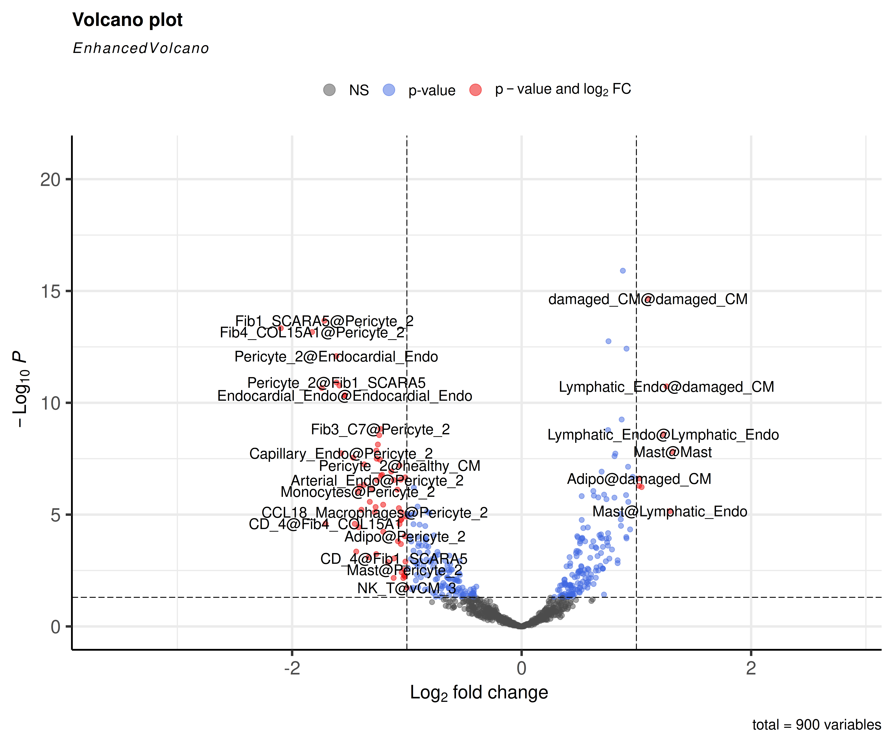

# Cell-Cell Communication Analysis of Human Myelofibrosis scRNA-seq Data Using CrossTalkeR

Here, we demonstrate the usage of CrossTalkeR on the case study of human myocardian infarction snRNA-seq data from the
Nature paper "Spatial multi-omic map of human myocardial infarction" (Kuppe et al.). 
Aim of the study was to build a high-resolution map of human cardiac remodelling after myocardial infarction to provide a better understanding of these remodelling processes.
We are focusing here on the conditions "myogenic" (control condition) and "ischemic" (disease condition) and go through the CrossTalkeR results step by step.

```{r, warning=FALSE,message=F, output=FALSE, eval = FALSE}
library(CrossTalkeR)
library(igraph)
library(stringr)

ischemic <- read.csv("ischemic_LR.csv")
myogenic <- read.csv("myogenic_LR.csv")

paths <- list("myogenic" = myogenic,
              "ischemic" = ischemic)

ctkroutput <- generate_report(paths,
                              out_path = "/save/path/",
                              out_file = "myocardial_infarction.html",
                              output_fmt = "html_document",
                              report = FALSE,
                              filtered_net = TRUE,
                              comparison = c("ischemic", "myogenic"))
```

```{r, warning=FALSE,message=F, output=FALSE, eval = FALSE}
plot_cci(graph = data@graphs$ischemic_x_myogenic,
        colors = data@colors,
        plt_name = "ischemic vs myogenic",
        coords = data@coords[V(data@graphs$ischemic_x_myogenic)$name,],
        emax = NULL,
        leg = FALSE,
        low = 0,
        high = 0,
        ignore_alpha = FALSE,
        log = FALSE,
        efactor = 8,
        vfactor = 12, 
        pg = data@rankings[["ischemic_x_myogenic"]]$Pagerank)
```

<figure class="figure" style="display: table; margin: auto; height: 50%; width: 50%;">
  
  <figcaption class="figcaption" style="display: table-caption; caption-side: bottom;"> </figcaption>
</figure>

```{r, warning=FALSE,message=F, output=FALSE, eval = FALSE}
EnhancedVolcano(data@stats$ischemic_x_myogenic,
                lab = data@stats$ischemic_x_myogenic$columns_name,
                x = "lodds",
                y = "p",
                pCutoff = 0.05)
```

<figure class="figure" style="display: table; margin: auto; height: 50%; width: 50%;">
  
  <figcaption class="figcaption" style="display: table-caption; caption-side: bottom;"> </figcaption>
</figure>

```{r, warning=FALSE,message=F, output=FALSE, eval = FALSE}
plot_cci(graph = data@graphs$ischemic_x_myogenic_filtered,
        colors = data@colors,
        plt_name = "ischemic vs myogenic filtered",
        coords = data@coords[V(data@graphs$ischemic_x_myogenic_filtered)$name,],
        emax = NULL,
        leg = FALSE,
        low = 0,
        high = 0,
        ignore_alpha = FALSE,
        log = FALSE,
        efactor = 8,
        vfactor = 12,
        pg = data@rankings[["ischemic_x_myogenic_filtered"]]$Pagerank)
```

<figure class="figure" style="display: table; margin: auto; height: 50%; width: 50%;">
  
  <figcaption class="figcaption" style="display: table-caption; caption-side: bottom;"> </figcaption>
</figure>

```{r, warning=FALSE,message=F, output=FALSE, eval = FALSE}
plot_bar_rankings(data, "ischemic_x_myogenic_filtered", "Pagerank", type = NULL, filter_sign = NULL)
plot_bar_rankings(data, "ischemic_x_myogenic_filtered", "Influencer", type = NULL, filter_sign = NULL)
plot_bar_rankings(data, "ischemic_x_myogenic_filtered", "Listener", type = NULL, filter_sign = NULL)
```

<figure class="figure" style="display: table; margin: auto; height: 50%; width: 50%;">
  
  <figcaption class="figcaption" style="display: table-caption; caption-side: bottom;"> </figcaption>
</figure>

&nbsp;   

<div style = "display: flex; align-items: center; justify-content: center;">
<figure class="figure" style="display: table; margin: auto; height: 60%; width: 60%;">
  
  <figcaption class="figcaption" style="display: table-caption; caption-side: bottom;"> </figcaption>
</figure>
<figure class="figure" style="display: table; margin: auto; height: 60%; width: 60%;">
  
  <figcaption class="figcaption" style="display: table-caption; caption-side: bottom;"> </figcaption>
</figure>
</div>


&nbsp;

```{r, warning=FALSE,message=F, output=FALSE, eval = FALSE}
plot_bar_rankings(data, "ischemic_x_myogenic_ggi", "Pagerank", type = "LR", filter_sign = NULL, mode = "cgi")
```

<figure class="figure" style="display: table; margin: auto; height: 50%; width: 50%;">
  
  <figcaption class="figcaption" style="display: table-caption; caption-side: bottom;"> </figcaption>
</figure>

&nbsp;  

```{r, warning=FALSE,message=F, output=FALSE, eval = FALSE}
plot_bar_rankings(data, "ischemic_x_myogenic_ggi", "Influencer", type = "L", filter_sign = NULL, mode = "cgi")
plot_bar_rankings(data, "ischemic_x_myogenic_ggi", "Listener", type = "R", filter_sign = NULL, mode = "cgi")
```

<div style = "display: flex; align-items: center; justify-content: center;">
<figure class="figure" style="display: table; margin: auto; height: 60%; width: 60%;">
  
  <figcaption class="figcaption" style="display: table-caption; caption-side: bottom;"> </figcaption>
</figure>
<figure class="figure" style="display: table; margin: auto; height: 60%; width: 60%;">
  
  <figcaption class="figcaption" style="display: table-caption; caption-side: bottom;"> </figcaption>
</figure>
</div> 

&nbsp;

```{r, warning=FALSE,message=F, output=FALSE, eval = FALSE}
plot_bar_rankings(data, "ischemic_x_myogenic_ggi", "Pagerank", type = NULL, filter_sign = NULL, mode = "cgi")
```

<figure class="figure" style="display: table; margin: auto; height: 50%; width: 50%;">
  
  <figcaption class="figcaption" style="display: table-caption; caption-side: bottom;"> </figcaption>
</figure>

&nbsp;

```{r, warning=FALSE,message=F, output=FALSE, eval = FALSE}
plot_bar_rankings(data, "ischemic_x_myogenic_ggi", "Mediator", type = "TF", filter_sign = NULL, mode = "cgi")
```

<figure class="figure" style="display: table; margin: auto; height: 50%; width: 50%;">
  
  <figcaption class="figcaption" style="display: table-caption; caption-side: bottom;"> </figcaption>
</figure>

```{r, warning=FALSE,message=F, output=FALSE, eval = FALSE}
plot_sankey(data@tables$ischemic_x_myogenic,
    target = NULL,
    ligand_cluster = "Fib2_Myofib",
    receptor_cluster = "SPP1_Macrophages",
    plt_name = "Fib2_Myofib to SPP1_Macrophages Signaling ischemic vs myogenic",
    threshold = 50, 
    tfflag = FALSE
)
```

<figure class="figure" style="display: table; margin: auto; height: 50%; width: 50%;">
  
  <figcaption class="figcaption" style="display: table-caption; caption-side: bottom;"> </figcaption>
</figure>

```{r, warning=FALSE,message=F, output=FALSE, eval = FALSE}
subset <- c("LYVE_FOLR_Macrophages",
"LYVE_PLTP_Macrophages",
"CCL18_Macrophages",
"SPP1_Macrophages",
"Monocytes",
"Fib4_COL15A1",
"Fib3_C7",
"Fib2_Myofib",
"Fib1_SCARA5")

plot_sankey(data@tables$ischemic_x_myogenic,
    target = "TGFB1|L",
    ligand_cluster = subset,
    receptor_cluster = subset,
    plt_name = "TGFB1 Signaling Between Cell Typse Subset ischemic vs myogenic",
    threshold = 50,
    tfflag = FALSE)
```

<figure class="figure" style="display: table; margin: auto; height: 50%; width: 50%;">
  
  <figcaption class="figcaption" style="display: table-caption; caption-side: bottom;"> </figcaption>
</figure>
