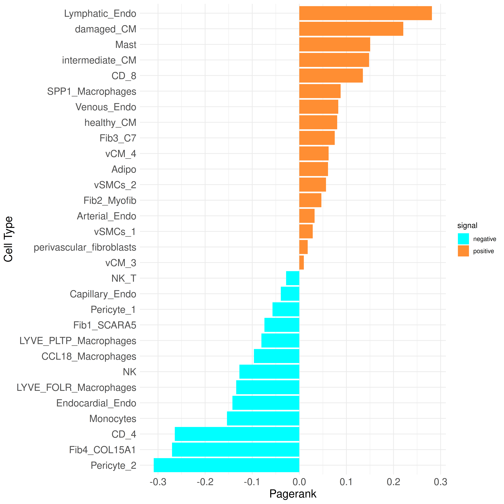
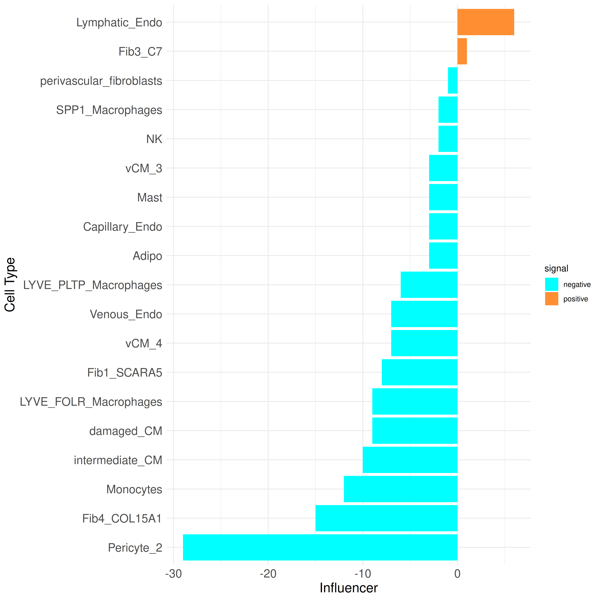
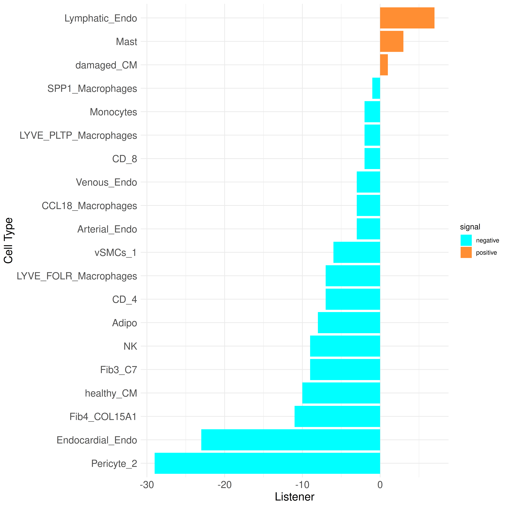
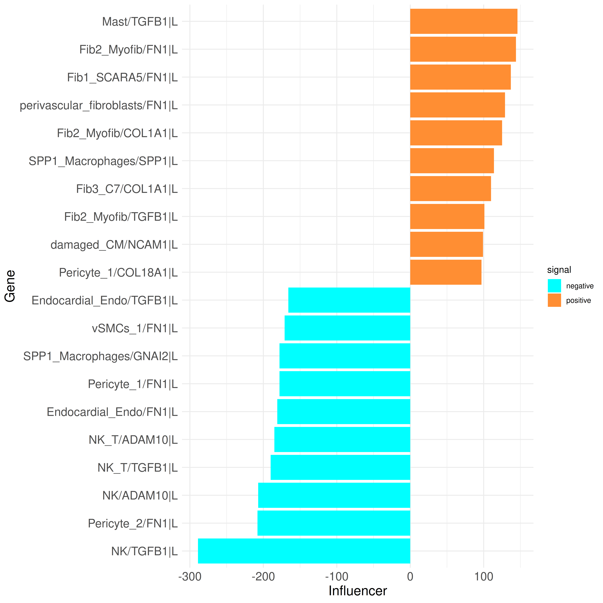
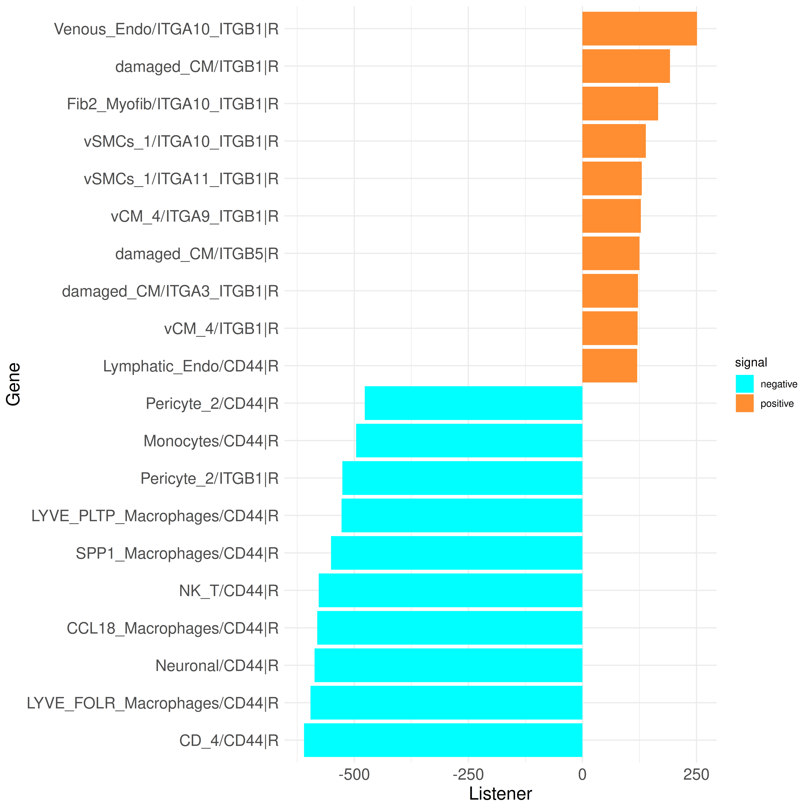

# Cell-Cell Communication Analysis of Human Myelofibrosis scRNA-seq Data Using CrossTalkeR

Here, we demonstrate the usage of CrossTalkeR on the case study of human myocardian infarction snRNA-seq data from the
Nature paper "Spatial multi-omic map of human myocardial infarction" (Kuppe et al.). 
Aim of the study was to build a high-resolution map of human cardiac remodelling after myocardial infarction to provide a better understanding of these remodelling processes.
We are focusing here on the conditions "myogenic" (control condition) and "ischemic" (disease condition) and go through the CrossTalkeR results step by step. The original paper already contains CrossTalkeR results and in a later part of this tutorial we will replicate a few of the results.

## Ligand-Receptor Interaction Prediction with LIANA

Before we can run CrossTalkeR, we need the prediction of ligand-receptor interaction for our data set. Due to the large sample size we are using the python version of LIANA for a better performance:

```{python, warning=FALSE,message=F, output=FALSE, eval = FALSE}
import scanpy as sc
import liana as li
import pandas as pd
import os

out_path = "/out/path/"
data = sc.read_h5ad("heart_data_object.h5ad")

data.raw = data

for i in set(data.obs['sampleType']):
    print(i)
    lr=li.method.cellphonedb(data[data.obs['sampleType']==i],
                        groupby='cell_subtype2',
                        expr_prop=0.1,
                        verbose=True,
                        resource_name='consensus',inplace=False)
    lr.to_csv(f"{out_path}{i}_lr_liana_consensus.csv")

for i in os.listdir(out_path):
    if i.endswith('lr_liana_consensus.csv'):
        evfull = pd.read_csv(out_path+i)
        evfull = evfull.loc[:,['ligand','receptor_complex','source','target','lr_means','cellphone_pvals']]
        evfull['type_gene_A'] = 'Ligand'
        evfull['type_gene_B'] = 'Receptor'
        evfull['gene_A'] = evfull['ligand']
        evfull['gene_B'] = evfull['receptor_complex']
        evfull['MeanLR'] = evfull['lr_means']
        k = i[0:i.find('_lr_')]
        evfull = evfull.loc[list(evfull.cellphone_pvals.to_numpy()<=0.05),:]
        evfull = evfull.loc[:, ['source', 'target', 'type_gene_A', 'type_gene_B', 'gene_A', 'gene_B', 'MeanLR']].to_csv(f'{out_path}{k}_lr_ready.csv')

```

## Intracellular Communication Analysis with IntraTalker

We can not only analyze the ligand-receptor interactions but also the intracellular communication. For this we use transcription factor activity predictions from decoupler and the IntraTalker package. Similar to usage of LIANA we are using the python version of decoupler:

```{python, warning=FALSE,message=F, output=FALSE, eval = FALSE}
import scanpy as sc
import decoupler as dc
import pandas as pd

file = "heart_data_object.h5ad"
reg = pd.read_csv("regulon_dorothea_human_AB.csv")
ann_data = sc.read_h5ad(file)

dc.run_ulm(
    mat=ann_data,
    net=reg,
    source='source',
    target='target',
    weight='weight',
    verbose=True,
    use_raw=False
)
estimates =ann_data.obsm['ulm_estimate']
estimates.to_csv("/out/path/decoupler_dorotheaAB_results_ulm.csv")

```

To find the transcription factors that show a significant different between the conditions and to connect the transcription factors to upstream receptors and downstream ligands we use the IntraTalker package. First we generate the intracellular communication tables based:

```{r, warning=FALSE,message=F, output=FALSE, eval = FALSE}
library(Seurat)
library(tibble)
library(dplyr)
library(igraph)
library(stringr)
library(LR2TF)
library(CrossTalkeR)

heart_data_object <- readRDS("heart_data_object.rds")

parameters <- list("out_path" = "/out/path/",
                   reg = "regulon_dorothea_human_AB.csv",
                   "organism" = "human",
                   "celltype" = "cell_subtype2",
                   "condition" = "sampleType",
                   "comparison_list" = list(c("ischemic", "myogenic")),
                   "logfc" = 1,
                   "pval" = 0.05)


results <- LR2TF::tf_activity_analysis(seuratobject = heart_data_object,
                                       tf_activities = "/out/path/decoupler_dorotheaAB_results_ulm.csv",
                                       arguments_list = parameters)
```

## Input Preparation for CrossTalkeR

In the next step, we combine the ligand-receptor and intracellular communication predictions to generate the input for CrossTalkeR:

```{r, warning=FALSE,message=F, output=FALSE, eval = FALSE}

ischemic_LR <- read.csv("/out/path/ischemic_lr_ready.csv", header = TRUE, row.names = 1)
myogenic_LR <- read.csv("/out/path/myogenic_lr_ready.csv", header = TRUE, row.names = 1)

ischemic_combined <- LR2TF::combine_LR_and_TF_complexes(results@CTR_input_condition$ischemic,
                                                     ischemic_LR,
                                                     "/out/path/",
                                                     "ischemic")
myogenic_combined <- LR2TF::combine_LR_and_TF_complexes(results@CTR_input_condition$myogenic,
                                                     myogenic_LR,
                                                     "/out/path/",
                                                     "myogenic")
```

now the input data for CrossTalkeR is ready and we can run the analysis.

## Running CrossTalkeR

The last step is to run CrossTalkeR:

```{r, warning=FALSE,message=F, output=FALSE, eval = FALSE}

paths <- list('myogenic' = myogenic_combined,              
              'ischemic' = ischemic_combined)

data <- generate_report(paths,
                            out_path = "/out/path/",
                            threshold = 0,
                            out_file = 'myocardial_infarction.html',
                            output_fmt = "html_document",
                            org = "hsa",
                            comparison = list(c('ischemic', 'myogenic')),
                            filtered_net = T)

```

&nbsp;  

# CrossTalkeR Results Ischemic vs Myogenic condition

The second part of this tutorial focuses on the results of the comparative analysis of ischemic versus myogenic conditions. 

## CCI Results

We start our result analysis with the cell-cell interaction (CCI) analysis of CrossTalkeR and therefore take a look at our CCI network plot:

```{r, warning=FALSE,message=F, output=FALSE, eval = FALSE}
plot_cci(graph = data@graphs$ischemic_x_myogenic,
        colors = data@colors,
        plt_name = "ischemic vs myogenic",
        coords = data@coords[V(data@graphs$ischemic_x_myogenic)$name,],
        emax = NULL,
        leg = FALSE,
        low = 0,
        high = 0,
        ignore_alpha = FALSE,
        log = FALSE,
        efactor = 8,
        vfactor = 12, 
        pg = data@rankings[["ischemic_x_myogenic"]]$Pagerank)
```

<figure class="figure" style="display: table; margin: auto; height: 100%; width: 100%;">
  
  <figcaption class="figcaption" style="display: table-caption; caption-side: bottom;"> </figcaption>
</figure>

In ischemic conditions, CCIs are generally reduced. However, certain cell types remain notably important, as highlighted by their higher Pagerank scores. These key cell types include cardiomyocyte clusters, two of the four fibroblast clusters, and specific myeloid cells, such as SPP1-expressing macrophages and mast cells. These findings indicate that despite the reduced overall interactions, these cell types are predicted to have a central role in the CCI network of the ischemic condition.

CrossTalkeR also offers a refined CCI network by employing Fisher's exact test to filter the network based on interaction proportions. We can plot the resulting statistics in a Violon Plot:

```{r, warning=FALSE,message=F, output=FALSE, eval = FALSE}
EnhancedVolcano(data@stats$ischemic_x_myogenic,
                lab = data@stats$ischemic_x_myogenic$columns_name,
                x = "lodds",
                y = "p",
                pCutoff = 0.05)
```

<figure class="figure" style="display: table; margin: auto; height: 100%; width: 100%;">
  
  <figcaption class="figcaption" style="display: table-caption; caption-side: bottom;"> </figcaption>
</figure>

Statistically significant points are labeled with the names of the corresponding edge pairs, with the significance threshold set to a p-value greater than 0.05 and a log2 fold change above one. We see that many of these significant interactions involve high Pagerank cell types, including fibroblast, cardiomyocyte, and myeloid cell clusters. Using this threshold (the default in CrossTalkeR), we can retain only interacting cell pairs with a p-value greater than 0.05 as an example, and replot the CCI network:

```{r, warning=FALSE,message=F, output=FALSE, eval = FALSE}
plot_cci(graph = data@graphs$ischemic_x_myogenic_filtered,
        colors = data@colors,
        plt_name = "ischemic vs myogenic filtered",
        coords = data@coords[V(data@graphs$ischemic_x_myogenic_filtered)$name,],
        emax = NULL,
        leg = FALSE,
        low = 0,
        high = 0,
        ignore_alpha = FALSE,
        log = FALSE,
        efactor = 8,
        vfactor = 12,
        pg = data@rankings[["ischemic_x_myogenic_filtered"]]$Pagerank)
```

<figure class="figure" style="display: table; margin: auto; height: 100%; width: 100%;">
  
  <figcaption class="figcaption" style="display: table-caption; caption-side: bottom;"> </figcaption>
</figure>

In the filtered CCI plot, positive edges become more visible, though all cell types remain except for the Neuronal and Purkinje_fibers clusters. The Pagerank of the nodes remains largely unchanged. 

To confirm the top cell types identified by Pagerank, we can examine their Pagerank scores in more detail using a bar plot:

```{r, warning=FALSE,message=F, output=FALSE, eval = FALSE}
plot_bar_rankings(data, "ischemic_x_myogenic_filtered", "Pagerank", type = NULL, filter_sign = NULL)
```

<figure class="figure" style="display: table; margin: auto; height: 100%; width: 100%;">
  
  <figcaption class="figcaption" style="display: table-caption; caption-side: bottom;"> </figcaption>
</figure>

We can further take a look at the Influencer and Listener ranking to observe which cell types are more sending or more receiving:

```{r, warning=FALSE,message=F, output=FALSE, eval = FALSE}
plot_bar_rankings(data, "ischemic_x_myogenic_filtered", "Influencer", type = NULL, filter_sign = NULL)
plot_bar_rankings(data, "ischemic_x_myogenic_filtered", "Listener", type = NULL, filter_sign = NULL)
``` 

<div style = "display: flex; align-items: center; justify-content: center;">
<figure class="figure" style="display: table; margin: auto; height: 60%; width: 60%;">
  
  <figcaption class="figcaption" style="display: table-caption; caption-side: bottom;"> </figcaption>
</figure>
<figure class="figure" style="display: table; margin: auto; height: 60%; width: 60%;">
  
  <figcaption class="figcaption" style="display: table-caption; caption-side: bottom;"> </figcaption>
</figure>
</div>

These plots highlight that nearly all cell types are predicted to communicate less in the ischemic condition compared to the myogenic condition. Exceptions include the Prolif, Lymphatic_Endo, Fib2_Myofib, and Fib3_C7 clusters, which exhibit a higher Influencer Score in the ischemic condition (indicating more outgoing signals). Additionally, the Lymphatic_Endo, damaged_CM, and Mast clusters show a higher Listener Score, indicating more incoming signals in ischemia.

Most of the observations at the CCI level are consistent with the findings in the paper. For instance, fibrotic structures are more prominent in the ischemic condition, which is also reflected in the Pagerank scores, as at least two out of the four fibroblast clusters have a higher Pagerank in the ischemic condition.

## CGI Results

Next, we shift to the gene-cell interaction (GCI) level. Similar to the CCI level, we can examine the network's topological rankings. We begin by reviewing the top Pagerank results, which identify genes within a specific cell type that are important in the network's signaling. For now, we will focus exclusively on ligand-receptor (LR) interactions.


```{r, warning=FALSE,message=F, output=FALSE, eval = FALSE}
plot_bar_rankings(data, "ischemic_x_myogenic_ggi", "Pagerank", type = "LR", filter_sign = NULL, mode = "cgi")
```

<figure class="figure" style="display: table; margin: auto; height: 100%; width: 100%;">
  
  <figcaption class="figcaption" style="display: table-caption; caption-side: bottom;"> </figcaption>
</figure>

&nbsp;  

In the top genes, we find both ligands (L) and receptors (R). Many of these genes are involved in immune system processes, such as integrin receptors (e.g., ITGA10_ITGB1, ITGA9, ITGB1, and others). These are predicted to play a larger role in certain clusters (e.g., Venous_Endo, Lymphatic_Endo, CD_8) or a smaller role in others (e.g., Pericyte_1, CD_4, Pericyte_2). Additionally, the TGFB1 ligand is among the top genes in the Fib3_C7 cluster, and the LRP1 receptor is found in SPP1_Macrophages.

To gain a clearer understanding of outgoing and incoming signals, we examine the ligands with the top Influencer scores and the receptors with the top Listener scores:

```{r, warning=FALSE,message=F, output=FALSE, eval = FALSE}
plot_bar_rankings(data, "ischemic_x_myogenic_ggi", "Influencer", type = "L", filter_sign = NULL, mode = "cgi")
plot_bar_rankings(data, "ischemic_x_myogenic_ggi", "Listener", type = "R", filter_sign = NULL, mode = "cgi")
```

<div style = "display: flex; align-items: center; justify-content: center;">
<figure class="figure" style="display: table; margin: auto; height: 60%; width: 60%;">
  
  <figcaption class="figcaption" style="display: table-caption; caption-side: bottom;"> </figcaption>
</figure>
<figure class="figure" style="display: table; margin: auto; height: 60%; width: 60%;">
  
  <figcaption class="figcaption" style="display: table-caption; caption-side: bottom;"> </figcaption>
</figure>
</div> 

&nbsp;

The list of top influencers mainly includes genes important in wound healing, fibrosis, and immune response (e.g., TGFB1, collagens, etc.). The receptors are primarily integrin receptors and subunits and CD44, which play key roles in immune response and tissue repair processes. These results, which have already been described in the paper, further support these findings.

Next, we create the Sankey plots for the ischemic vs. myogenic comparisons, as shown in extended figures 12d and e in the original paper. It is important to note that these plots may differ slightly, as we are using newer versions of the LIANA package and, for simplicity, we are considering fewer samples in this tutorial.

We begin with the Sankey plots showing signaling between the Fib2 and SPP1_Macrophages clusters (in both directions):

```{r, warning=FALSE,message=F, output=FALSE, eval = FALSE}
plot_sankey(data@tables$ischemic_x_myogenic,
    target = NULL,
    ligand_cluster = "Fib2_Myofib",
    receptor_cluster = "SPP1_Macrophages",
    plt_name = "Fib2_Myofib to SPP1_Macrophages Signaling ischemic vs myogenic",
    threshold = 50, 
    tfflag = FALSE
)
```

<figure class="figure" style="display: table; margin: auto; height: 100%; width: 100%;">
  
  <figcaption class="figcaption" style="display: table-caption; caption-side: bottom;"> </figcaption>
</figure>

&nbsp;

```{r, warning=FALSE,message=F, output=FALSE, eval = FALSE}
plot_sankey(data@tables$ischemic_x_myogenic,
    target = NULL,
    ligand_cluster = "SPP1_Macrophages",
    receptor_cluster = "Fib2_Myofib",
    plt_name = "SPP1_Macrophages to Fib2_Myofib Signaling ischemic vs myogenic",
    threshold = 50, 
    tfflag = FALSE
)
```

<figure class="figure" style="display: table; margin: auto; height: 100%; width: 100%;">
  
  <figcaption class="figcaption" style="display: table-caption; caption-side: bottom;"> </figcaption>
</figure>

&nbsp;

Additionally, a Sankey plot was created for a subset of cell types, displaying only interactions involving the TGFB1 ligand:

```{r, warning=FALSE,message=F, output=FALSE, eval = FALSE}
subset <- c("LYVE_FOLR_Macrophages",
"LYVE_PLTP_Macrophages",
"CCL18_Macrophages",
"SPP1_Macrophages",
"Monocytes",
"Fib4_COL15A1",
"Fib3_C7",
"Fib2_Myofib",
"Fib1_SCARA5")

plot_sankey(data@tables$ischemic_x_myogenic,
    target = "TGFB1|L",
    ligand_cluster = subset,
    receptor_cluster = subset,
    plt_name = "TGFB1 Signaling Between Cell Type Subset ischemic vs myogenic",
    threshold = 50,
    tfflag = FALSE)
```

<figure class="figure" style="display: table; margin: auto; height: 100%; width: 100%;">
  
  <figcaption class="figcaption" style="display: table-caption; caption-side: bottom;"> </figcaption>
</figure>

&nbsp;

