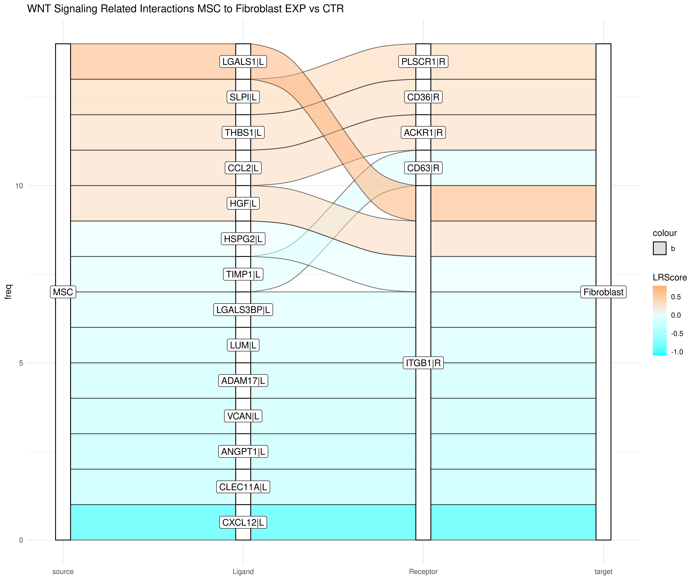

# Ligand-Receptor Pathway Enrichment with Progeny - Example

The liana+ Python documentation includes an example of performing pathway enrichment on ligand-receptor interactions derived from tensor cell2cell analysis ([liana+ Tutorial](https://liana-py.readthedocs.io/en/latest/notebooks/liana_c2c.html)). Here, we apply this downstream pathway enrichment approach to CrossTalkeR results using human bone marrow example data ([Tutorial](https://costalab.github.io/CrossTalkeR/articles/HumanFibrosis.html)).

## Filter CrossTalkeR Results (in R)

We begin by loading the CrossTalkeR object and extracting the table of ligand-receptor interactions obtained from the comparison analysis of control and disease conditions.
```{R, eval = FALSE}
library(CrossTalkeR)

CrossTalkeR_results <- readRDS("LR_data_final.Rds")
EXP_x_CTR_table <- as.data.frame(CrossTalkeR_results@tables$EXP_x_CTR)
```

To facilitate the use of liana+ functions, we reformat and filter the table, resulting in a structured dataset with ligand-receptor pairs in the first column and the corresponding LRScores for each cell pair in the other columns.
```{R, eval = FALSE}
source_cluster <- c("MSC", "Megakaryocyte", "Fibroblast", "Myeloid")
target_cluster <- c("MSC", "Megakaryocyte", "Fibroblast", "Myeloid")

merged_df <- data.frame()

for (source in source_cluster){
  for (target in target_cluster) {
    comparisonLR_filtered <- comparison_LR[comparison_LR$source == source & comparison_LR$target == target, ]
    
    comparisonLR_filtered$genepair <- paste(gsub("\\|L", "", as.character(comparisonLR_filtered$gene_A)),
                                            gsub("\\|R", "", as.character(comparisonLR_filtered$gene_B)),
                                            sep = "@")
    
    comparisonLR_filtered <- data.frame(LRScore = comparisonLR_filtered$LRScore, row.names = comparisonLR_filtered$genepair)
    colnames(comparisonLR_filtered) <- paste(source, target, sep = "_")
    
    if (nrow(merged_df) == 0) {
      merged_df <- comparisonLR_filtered
    } else {
      merged_df <- merge(merged_df, comparisonLR_filtered, by = "row.names", all = TRUE)
      rownames(merged_df) <- merged_df$Row.names
      merged_df <- merged_df[ , -1]
    }
  }
}

write.csv(merged_df, paste("pairwise_LR_interactions.csv"))

```

Due to certain functionalities being unavailable in the R version of liana, the subsequent analyses are conducted in Python.

## Enrichment Analysis with Progeny and decoupleR (in Python)
We start with loading all necessary Python libraries.
```{python, eval = FALSE}
import pandas as pd

import liana as li
import omnipath as op
import decoupler as dc

import seaborn as sns
import matplotlib.pyplot as plt
```

To perform pathway enrichment analysis, we require a pathway database containing gene sets. For this purpose, we utilize the Progeny Pathway database, setting the top argument to 20,000 to load the complete dataset.
```{python, eval = FALSE}
# Load Progeny Pathway Database
progeny = dc.get_progeny(organism='human', top=20000)
```

Since the analysis considers ligand-receptor pairs rather than individual genes, we must first map these interactions to relevant pathways. To achieve this, we load the Consensus database from liana, which was also used for ligand-receptor interaction inference in this data. A dedicated function then assigns ligand-receptor pairs to their respective pathways.
```{python, eval = FALSE}
# Load Ligand-Receptor Pairs from liana Consensus Database
lr_pairs = li.resource.select_resource('consensus')

# Assign Ligand-Receptor Pairs to Progeny Pathways
lr_progeny = li.rs.generate_lr_geneset(lr_pairs, progeny, lr_sep="@")
```

Next, we incorporate the ligand-receptor interactions of interest, extracted from the CrossTalkeR results, and conduct the enrichment analysis using the decoupler ULM method along with the ligand-receptor pathway mapping. This analysis yields two data frames: one containing the enrichment estimation values and another reporting the corresponding p-values, indicating statistical significance. Since we consider multiple cell pairs, we need to iterate over the coloumns of the interactions table.
```{python, eval = FALSE}
# Load Ligand-Receptor Interactions for Enrichment Analysis
lr_interactions = pd.read_csv("pairwise_LR_interactions.csv", index_col=0)

# Empty Lists for Enrichment Results
estimate_list = []
pvals_list = []

for col in lr_interactions.columns:
    
    filtered_df = pd.DataFrame(lr_interactions[lr_interactions[col] != 0][col])
    
    # Run Enrichment Analysis with decoupleR ULM Method
    estimate, pvals = dc.run_ulm(filtered_df.T, lr_progeny, source="source", target="interaction", use_raw=False)
    
    estimate_list.append(estimate)
    pvals_list.append(pvals)

# Merge Enrichment Results and Replace NaN Values
merged_estimate = pd.concat(estimate_list, axis=0)
merged_estimate.fillna(0, inplace=True)
merged_pvals = pd.concat(pvals_list, axis=0)
```

## Visualize Results (in Python)

To visualize the results, we generate a heatmap using seaborn. To highlight pathways with significant enrichment estimations, we first create an annotation data frame, which is then incorporated into the heatmap visualization.
```{python, eval = FALSE}
# Mapping to Vizualize P-Value Significance Levels
def p_value_to_asterisks(p):
    if p < 0.001:
        return '***'
    elif p < 0.01:
        return '**'
    elif p < 0.05:
        return '*'
    else:
        return ' '
pval_mapping = merged_pvals.applymap(p_value_to_asterisks)

# Removing rows with only non-significnt enrichment values
is_significant_enriched = pval_mapping.apply(lambda row: any('*' in str(val) for val in row), axis=1)
filtered_estimate = merged_estimate[is_significant_enriched]
filtered_pval_mapping = pval_mapping[is_significant_enriched]


# Vizualize Enrichment Results with Seaborn Clustermap
sns.clustermap(filtered_estimate, 
               annot=filtered_pval_mapping,
               fmt='',
               row_cluster=False,
               figsize=(7, 2),
               cmap="vlag",
               cbar_pos=(1, .2, .03, .4),
               vmin=-3.5,
               vmax=3.5)

```

<figure class="figure" style="display: table; margin: auto; height: 100%; width: 100%;">
  
  <figcaption class="figcaption" style="display: table-caption; caption-side: bottom;"> </figcaption>
</figure>

<br/><br/>

The heatmap shows, that signaling in the WNT pathway is significantly enriched in the ligand-receptor interactions between MSCs and fibroblasts. Further the result indicates that this pathway is up in the disease condition. On the other hand MAPK and VEGF pathways are predicted to be down in the disease condition.

## Extraction and Visualization of WNT-Related Ligand-Receptor Interactions

To further dissect which interaction in our analysis relate to the WNT pathway, we can extract the relevant ligand-receptor pairs ftom the previous assignment with the progeny database:

```{python, eval = FALSE}
# Extracting all WNT-related Ligand-Receptor Interactions
wnt_interactions = lr_progeny[lr_progeny['source'] == 'WNT']

# Split the "interaction" column by "@"
split_interactions = wnt_interactions['interaction'].str.split('@', expand=True)

# Rename the columns to "ligand" and "receptor"
split_interactions.rename(columns={0: 'ligand', 1: 'receptor'}, inplace=True)

# Save the result as a CSV file
split_interactions.to_csv("/home/vanessa/Projekte/Documentation_Scripts/Human_BM_complete_vignette_code/WNT_interactions.csv", index=False)

```

With the saved ligand-receptor pairs, we can filter the differential interactions table from CrossTalkeR and visualize the WNT-related interactions with a sankey plot:

```{R, eval = FALSE}
# Load CSV file with WNT-related interactions from Progeny
WNT_interactions <- read.csv("/home/vanessa/Projekte/Documentation_Scripts/Human_BM_complete_vignette_code/WNT_interactions.csv")

# Add suffixes to ligand and receptor columns
WNT_interactions$ligand <- paste0(WNT_interactions$ligand, "|L")
WNT_interactions$receptor <- paste0(WNT_interactions$receptor, "|R")

# Filter the differential EXP_x_CTR table for WNT-related interactions
WNT_filtered_interactions <- EXP_x_CTR_table[EXP_x_CTR_table$gene_A %in% WNT_interactions$ligand & 
                                             EXP_x_CTR_table$gene_B %in% WNT_interactions$receptor, ]

#Plot the filtered interactions with CrossTalkeR sankey plot function
plot_sankey(WNT_filtered_interactions,
            target = NULL,
            ligand_cluster = "MSC",
            receptor_cluster = "Fibroblast",
            plt_name = "WNT Signaling Related Interactions MSC to Fibroblast EXP vs CTR",
            threshold = 50, tfflag = FALSE)
```

<figure class="figure" style="display: table; margin: auto; height: 100%; width: 100%;">
  
  <figcaption class="figcaption" style="display: table-caption; caption-side: bottom;"> </figcaption>
</figure>

